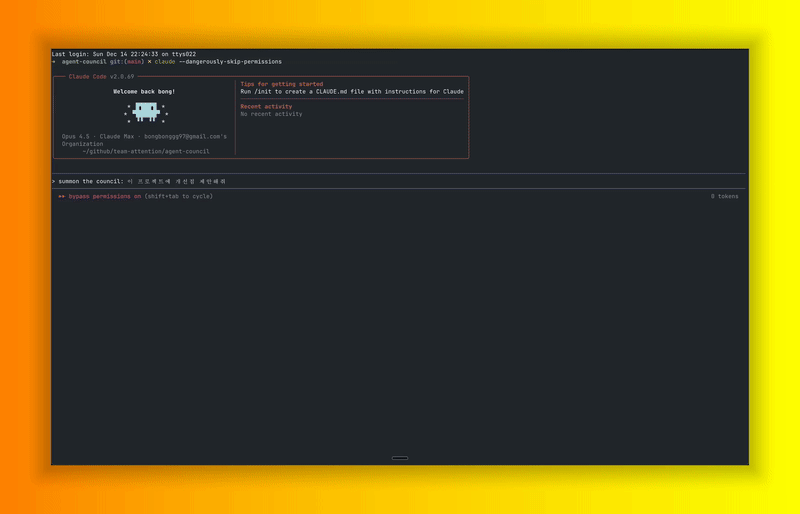
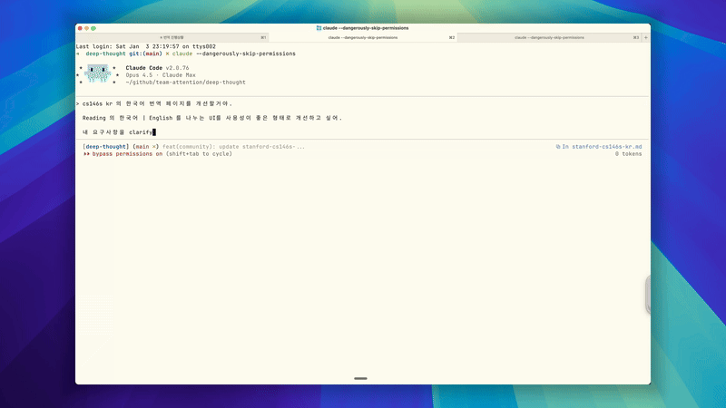
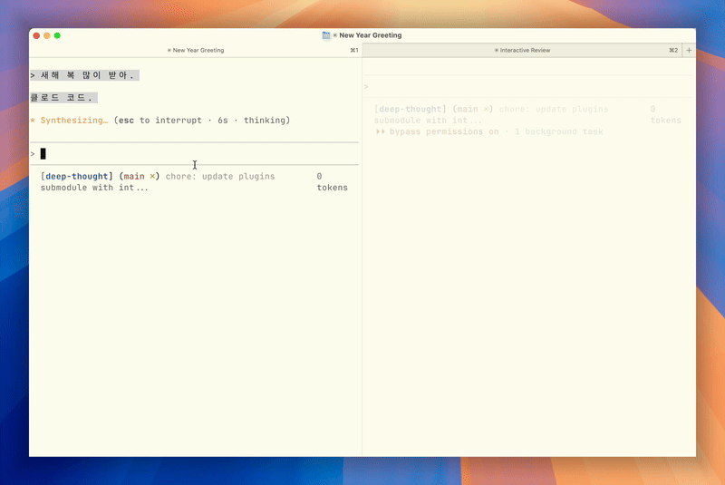
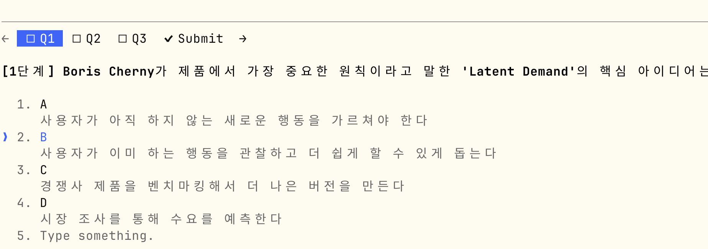

# Plugins for Claude Natives

A collection of Claude Code plugins for power users who want to extend Claude Code's capabilities beyond the defaults.

## Table of Contents

- [Quick Start](#quick-start)
- [Available Plugins](#available-plugins)
- [Plugin Details](#plugin-details)
  - [agent-council](#agent-council) - Get consensus from multiple AI models
  - [clarify](#clarify) - Transform vague requirements into specs
  - [dev](#dev) - Scan developer communities for opinions
  - [interactive-review](#interactive-review) - Review plans with a web UI
  - [say-summary](#say-summary) - Hear responses via text-to-speech
  - [youtube-digest](#youtube-digest) - Summarize and quiz on YouTube videos
  - [google-calendar](#google-calendar) - Multi-account calendar integration
  - [session-wrap](#session-wrap) - Multi-agent session wrap-up workflow
- [Contributing](#contributing)
- [License](#license)

---

## Quick Start

```bash
# Add this marketplace to Claude Code
/plugin marketplace add team-attention/plugins-for-claude-natives

# Install any plugin
/plugin install <plugin-name>
```

---

## Available Plugins

| Plugin | Description |
|--------|-------------|
| [agent-council](./plugins/agent-council/) | Collect and synthesize opinions from multiple AI agents (Gemini, GPT, Codex) |
| [clarify](./plugins/clarify/) | Transform vague requirements into precise specifications through iterative questioning |
| [interactive-review](./plugins/interactive-review/) | Interactive markdown review with web UI for visual plan/document approval |
| [say-summary](./plugins/say-summary/) | Speaks a short summary of Claude's response using macOS TTS (Korean/English) |
| [youtube-digest](./plugins/youtube-digest/) | Summarize YouTube videos with transcript, insights, Korean translation, and quizzes |
| [google-calendar](./plugins/google-calendar/) | Multi-account Google Calendar integration with parallel querying and conflict detection |
| [session-wrap](./plugins/session-wrap/) | Session wrap-up workflow with multi-agent analysis for documentation, automation, learning, and follow-up |

## Plugin Details

### agent-council



**Summon multiple AI models to debate your question and reach a consensus.**

When you're facing a tough decision or want diverse perspectives, this plugin queries multiple AI agents (Gemini CLI, GPT, Codex) in parallel and synthesizes their opinions into a single, balanced answer.

**Trigger phrases:**
- "summon the council"
- "ask other AIs"
- "what do other models think?"

**How it works:**
1. Your question is sent to multiple AI agents simultaneously
2. Each agent provides its perspective
3. Claude synthesizes the responses into a consensus view with noted disagreements

```bash
# Example
User: "summon the council - should I use TypeScript or JavaScript for my new project?"
```

---

### clarify



**Turn vague requirements into precise, actionable specifications.**

Before writing code based on ambiguous instructions, this plugin conducts a structured interview to extract exactly what you need. No more assumptions, no more rework.

**Trigger phrases:**
- "/clarify"
- "clarify requirements"
- "what do I mean by..."

**The process:**
1. **Capture** - Record the original requirement verbatim
2. **Question** - Ask targeted multiple-choice questions to resolve ambiguities
3. **Compare** - Present before/after showing the transformation
4. **Save** - Optionally save the clarified spec to a file

**Example transformation:**

| Before | After |
|--------|-------|
| "Add a login feature" | Goal: Add username/password login with self-registration. Scope: Login, logout, registration, password reset. Constraints: 24h session, bcrypt, rate limit 5 attempts. |

---

### dev

**Scan developer communities for real opinions on any tech topic.**

Want to know what developers actually think about a framework, tool, or practice? This plugin searches Reddit, Hacker News, Dev.to, and Lobsters in parallel to gather diverse perspectives.

**Trigger phrases:**
- "developer reactions to..."
- "what do devs think about..."
- "community opinions on..."

**Output includes:**
- **Consensus** - Points mentioned across multiple sources
- **Controversy** - Where opinions diverge
- **Notable perspectives** - Unique insights from experienced devs
- **Platform temperature** - Overall sentiment by community

```bash
# Example
User: "What do developers think about React 19?"
```

---

### interactive-review

**Review Claude's plans and documents through a visual web interface.**

Instead of reading long markdown in the terminal, this plugin opens a browser-based UI where you can check/uncheck items, add comments, and submit structured feedback.

**Trigger phrases:**
- "/review"
- "review this plan"
- "let me check this"

**The flow:**
1. Claude generates a plan or document
2. A web UI opens automatically in your browser
3. Review each item with checkboxes and optional comments
4. Click Submit to send structured feedback back to Claude
5. Claude adjusts based on your approved/rejected items

---

### say-summary



**Hear Claude's responses spoken aloud (macOS only).**

This plugin uses a Stop hook to summarize Claude's response to a short headline and speaks it using macOS text-to-speech. Perfect for when you're coding and want audio feedback.

**Features:**
- Summarizes responses to 3-10 words using Claude Haiku
- Auto-detects Korean vs English
- Uses appropriate voice (Yuna for Korean, Samantha for English)
- Runs in background, doesn't block Claude Code

**Requirements:**
- macOS (uses the `say` command)
- Python 3.10+

---

### youtube-digest



**Summarize YouTube videos with transcripts, translations, and comprehension quizzes.**

Drop a YouTube URL and get a complete breakdown: summary, key insights, full Korean translation of the transcript, and a 3-stage quiz (9 questions total) to test your understanding.

**Trigger phrases:**
- "summarize this YouTube"
- "digest this video"
- YouTube URL

**What you get:**
1. **Summary** - 3-5 sentence overview with key points
2. **Insights** - Actionable takeaways and ideas
3. **Full transcript** - With Korean translation and timestamps
4. **3-stage quiz** - Basic, intermediate, and advanced questions
5. **Deep Research** (optional) - Web search to expand on the topic

**Output location:** `research/readings/youtube/YYYY-MM-DD-title.md`

---

### google-calendar


**Manage multiple Google Calendar accounts from Claude Code.**

Query, create, update, and delete events across multiple Google accounts (work, personal, etc.) with automatic conflict detection.

**Trigger phrases:**
- "show my schedule"
- "what's on my calendar"
- "create a meeting"
- "check for conflicts"

**Features:**
- Parallel querying across multiple accounts
- Conflict detection between accounts
- Full CRUD operations (create, read, update, delete)
- Pre-authenticated with refresh tokens (no repeated logins)

**Setup required:**
1. Create Google Cloud project with Calendar API
2. Run setup script for each account

```bash
# One-time setup per account
uv run python scripts/setup_auth.py --account work
uv run python scripts/setup_auth.py --account personal
```

---

### session-wrap

**Comprehensive session wrap-up with multi-agent analysis.**

End your coding sessions with a thorough analysis that captures documentation needs, automation opportunities, learnings, and follow-up tasks.

**Trigger phrases:**
- `/wrap`
- `/wrap [commit message]` (quick commit)

**How it works (2-Phase Pipeline):**

1. **Phase 1 (Parallel)** - 4 specialized agents analyze simultaneously:
   - `doc-updater`: Documentation gaps (CLAUDE.md, context.md)
   - `automation-scout`: Automation opportunities (skill/command/agent)
   - `learning-extractor`: TIL-format learnings
   - `followup-suggester`: Prioritized follow-up tasks

2. **Phase 2 (Sequential)** - Validation:
   - `duplicate-checker`: Validates proposals against existing content

3. **User Selection** - Choose which actions to execute

**Benefits:**
- Never forget to document important discoveries
- Identify patterns worth automating
- Create clear handoff points for future sessions
- Build organizational knowledge over time

---

## Contributing

Contributions welcome! Please open an issue or PR.

## License

MIT
